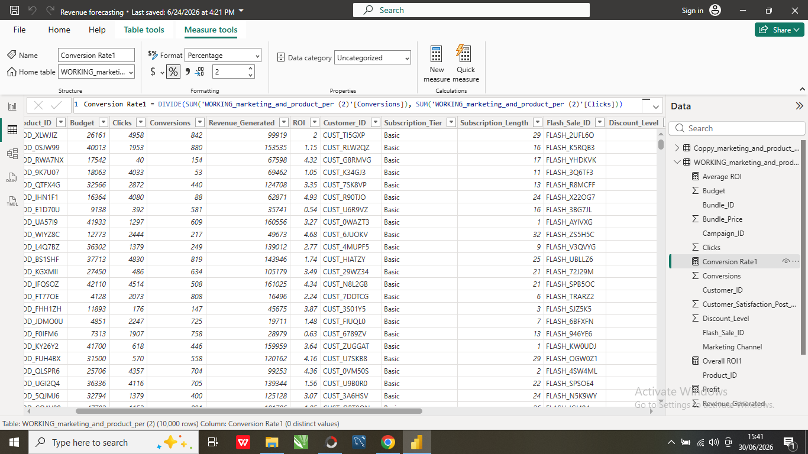

# 📊 Digital Campaign Revenue Forecasting

## Project Overview

This project analyzes digital marketing campaign performance across multiple channels to evaluate revenue generation, return on investment (ROI), customer subscriptions, and campaign effectiveness. The interactive Power BI dashboard provides actionable insights to help marketing teams optimize budget allocation and improve campaign performance.

---

## Business Problem

Marketing teams invest significant budgets across multiple advertising channels, but determining which channels deliver the highest returns is essential for maximizing profitability.

This project answers the following business questions:

- Which marketing channel generates the highest revenue?
- Which channel provides the highest return on investment (ROI)?
- Which subscription tier contributes the most revenue?
- How effective are the marketing campaigns at driving conversions?
- How can marketing budgets be better allocated?

---

## Tools Used

- Microsoft Power BI
- Microsoft Excel
- Power Query
- DAX
- Data Cleaning
- Data Visualization

---

## Dataset Overview

The dataset contains over 10,000 marketing campaign records with information including:
- Marketing Channel
- Campaign Budget
- Revenue Generated
- Clicks
- Conversions
- ROI
- Profit
- Units Sold
- Subscription Tier

---

## Dashboard Preview

---

## Key Performance Indicators (KPIs)

| KPI | Value |
|------|-------:|
| Total Budget | 253M |
| Total Revenue | 1.22B |
| Overall ROI | 382.96% |
| Profit | 968M |
| Conversion Rate | 20.10% |
| Total Clicks | 25M |

---

# Key Insights

### Revenue by Marketing Channel
- Affiliate Marketing generated the highest revenue.
- TikTok followed closely behind.
- Facebook and Google produced relatively similar revenue figures.

### Return on Investment
- Facebook recorded the highest average ROI among all marketing channels.
- ROI was fairly balanced across all channels, indicating efficient campaign performance.

### Subscription Performance
- The Basic subscription tier generated the highest overall revenue.
- Subscription numbers were evenly distributed across all three tiers.

### Marketing Performance
- Marketing campaigns generated over **1.22 billion** in revenue from a budget of **253 million**, resulting in an impressive **382.96% ROI**.
- Campaigns achieved a conversion rate of **20.10%**, demonstrating effective customer acquisition.

---

# Recommendations

- Increase investment in Affiliate and TikTok campaigns due to their strong revenue performance.
- Scale Facebook campaigns while maintaining their high ROI efficiency.
- Introduce upselling strategies to convert Basic subscribers into Premium plans.
- Improve conversion rates through audience segmentation, A/B testing, and optimized landing pages.
- Continuously monitor campaign performance and reallocate budgets toward high-performing channels.

---

# Business Impact

This dashboard enables stakeholders to:

- Monitor marketing performance in real time.
- Evaluate campaign profitability.
- Optimize marketing budget allocation.
- Improve customer acquisition strategies.
- Make informed, data-driven business decisions.

---

# Skills Demonstrated

- Data Cleaning
- Data Modeling
- DAX Calculations
- KPI Development
- Dashboard Design
- Marketing Analytics
- Data Visualization
- Business Intelligence
- Data Storytelling

---

